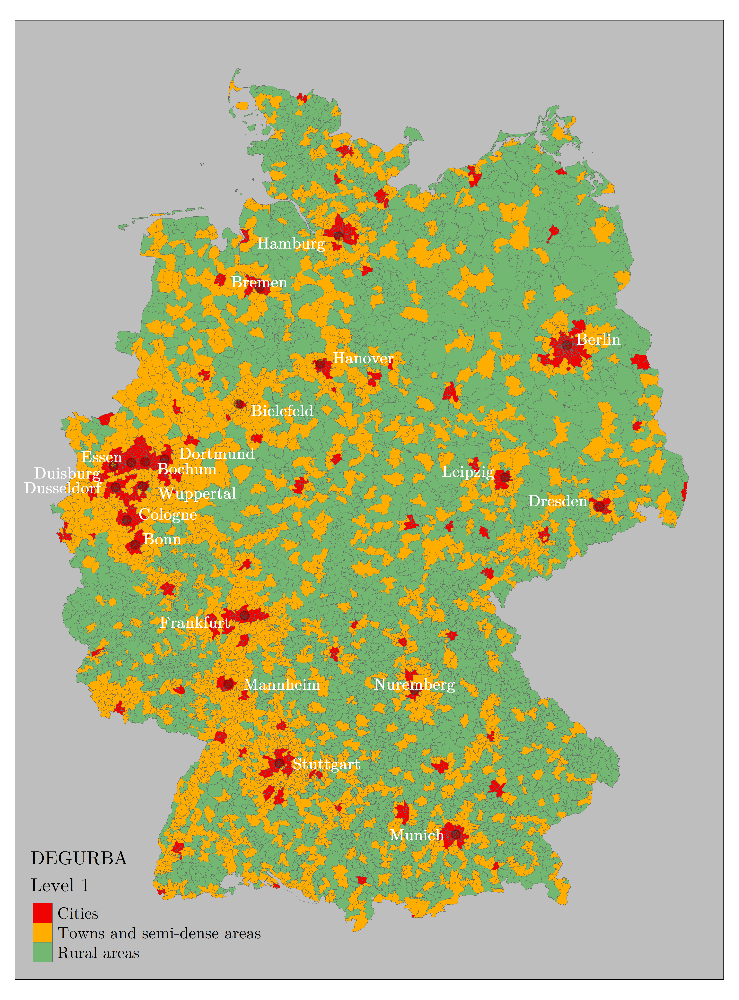

# The Degree of Urbanisation Classification for Postcode Areas

This repository contains R code to implement level 1 and 2 of the degree of urbanisation (DEGURBA) classification (see Dijkstra et al 2020 and Eurostat 2021) and to superimpose the grid cell classifications on postcode areas. The procedure is applied for five countries: France, Germany, Spain, Switzerland, and the United Kingdom.

Eurostat 2021
https://ec.europa.eu/eurostat/en/web/products-manuals-and-guidelines/-/ks-02-20-499

Dijkstra et al 2020
https://www.sciencedirect.com/science/article/pii/S0094119020300838#cit_5

# Data sources

The classification is based on the following data sources. Data are downloaded with the data.R script.

2018 GEOSTAT 1sqkm population grids
https://ec.europa.eu/eurostat/en/web/gisco/geodata/reference-data/population-distribution-demography/geostat

2021 NUTS0 country border polygons
https://ec.europa.eu/eurostat/en/web/gisco/geodata/reference-data/administrative-units-statistical-units/nuts#nuts21

2018 Urban audit data including functional urban areas
https://ec.europa.eu/eurostat/en/web/gisco/geodata/reference-data/administrative-units-statistical-units/urban-audit#ua18

Postcode areas for France (), Germany (), Spain (), Switzerland (), and the United Kingdom ().

# Classification procedure

The degree of urbanisation is a classification scheme for 1sqkm grids and small spatial units. The methodology is described in detail in ... 

Level 1 ... Level 2 further ... Functional urban areas ... To superimpose on spatial units ...

# Example: Germany region

  

    
  

  

    
  

.column {
  float: left;
  width: 50%;
  padding: 5px;
}

.row::after {
  content: "";
  clear: both;
  display: table;
}